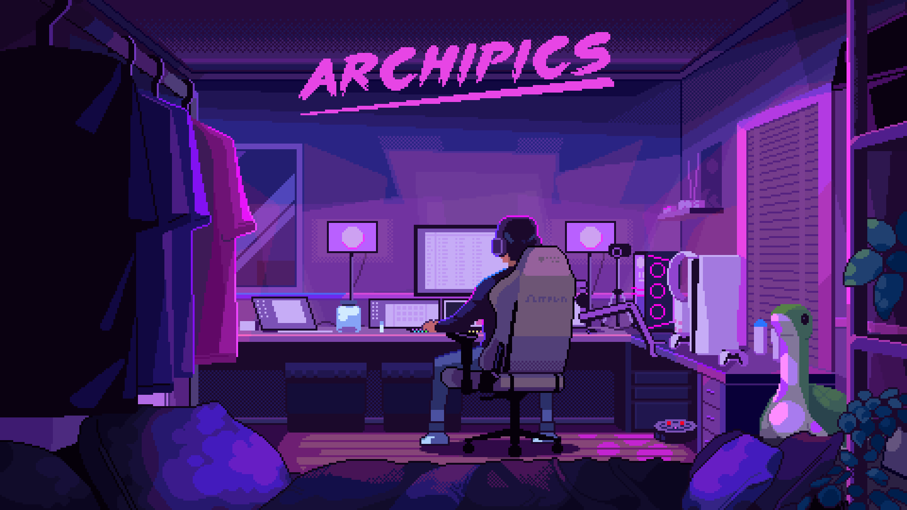

## Hi there 👋

<!--
# Hi 👋, I'm Nivedh

💡 I'm a self-taught developer who loves building things.  
🌱 Currently learning **Data Science**  
⚡ Fun fact: I type at 120+ WPM

---

## 🚀 Skills
- 💻 Languages: Python, JavaScript, C++
- 🌐 Web: HTML/CSS,SQL
- 📊 Databases: MySQL, MongoDB

---

## 📊 GitHub Stats

---

## 
- 🌟 Open source contributor
- 🔥 Fast learner
- 🛡️ Data Science

-->

  

